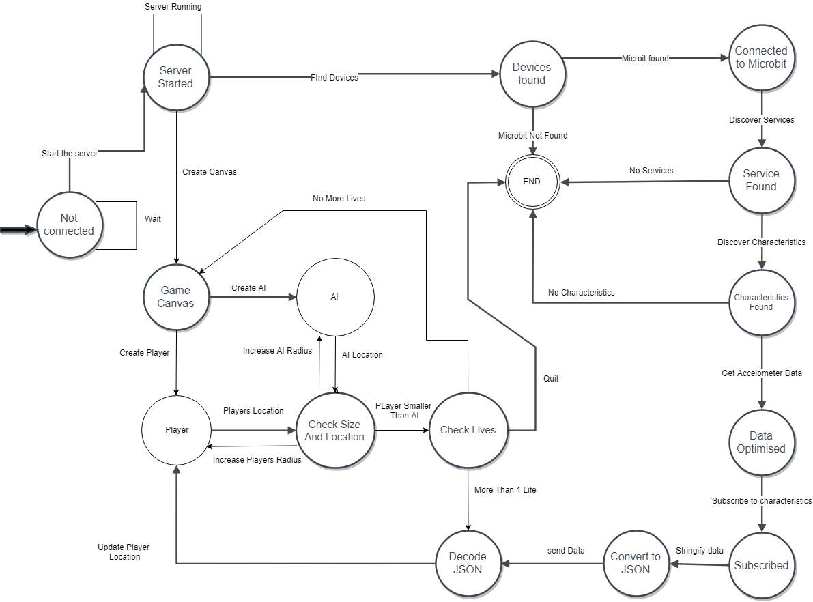

# BLE Circle Game - Challenge 3

This our submission of the third challenge where we created a communication protocol which allows a MicroBit to communicate to another device using Bluetooth Low Energy. Within 
this we created a simple game that allows you to move a player on the website with the accelerometer on the MicroBit. The game works by eating the smaller circles to make your player grow bigger. You also only have three lives and you can loss lives by getting eaten yourself. 

We did try to add the functionality of sending the score data back to the MicroBit. Unfortunately, we could not find a solution and are still looking into how we can subscribe to the services Async.

## Editors
* Martyn Fitzgerald - 16025948
* Dawid Koleczko   - 17024154  

## Finite State Diagram

This is a diagram that shows our system implementation and how it runs.

<div align="center">

</div>

## Software Used

* Ubuntu 16.04 LTS
* Atom
* Lucid Chart

## Controls

* Angle the MicroBit where you would like to move your player too.

## Installation

1. Fork this project to your GitLab.
2. Clone your project to your computer's workspace.
```bash
git clone https://gitlab.uwe.ac.uk/m4-fitzgerald/ufcfvk-15-2-iot.git
```
3. Open Terminal. Install yotta and dependencies.
```bash
sudo apt-get update
sudo apt-get install cmake ninja-build gcc-arm-none-eabi srecord libssl-dev
sudo apt-get install python-pip
sudo pip install yotta
sudo apt-get install srecord

yt target bbc-microbit-classic-gcc
```
4. Then go to where you have placed the project.
```bash
cd project/examples
```
5. You need to set the target for the project.
```bash
yt target bbc-microbit-classic-gcc
```
6. Build the project.
```bash
yt build
```
7. Once built, then copy the .hex file to your MicroBit (Make sure it's connected to your computer).
```bash
cp ./build/bbc-microbit-classic-gcc/source/microbit-samples-combined.hex /media/MICROBIT
```
8. You should see your MicroBit start.

9. Download node.js from https://nodejs.org/en/download/

10. Go through the setup application.